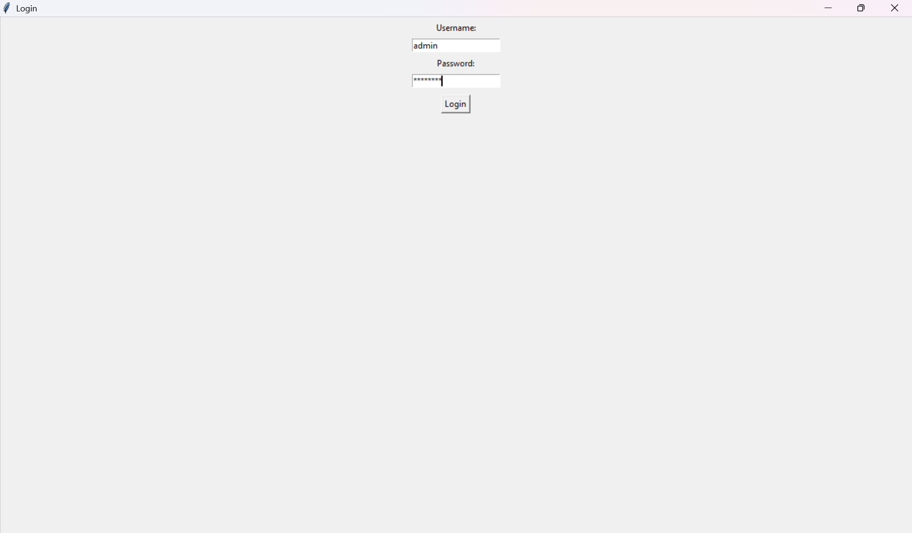
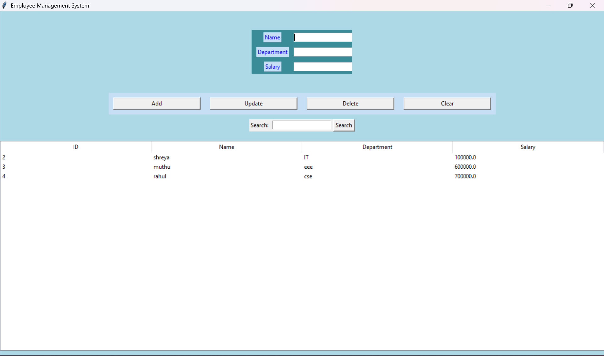

# 🧾 Employee Management System

A simple desktop application to manage employee records, built using **Python**, **Tkinter**, and **SQLite**.

---

## 🔧 Features

- ✅ Login Authentication (username + password)
- ✅ Add, Update, Delete employee records
- ✅ Search employee by name or department
- ✅ GUI with responsive layout
- ✅ Local database using SQLite

---

## 🚀 How to Run

Make sure Python 3 is installed.

## 📸 Screenshots

### 🔐 Login Screen  

### 🧾 Employee Dashboard  

